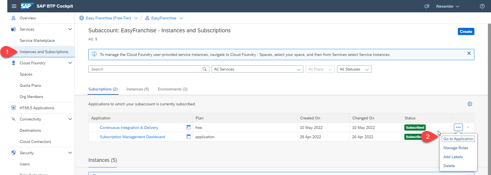
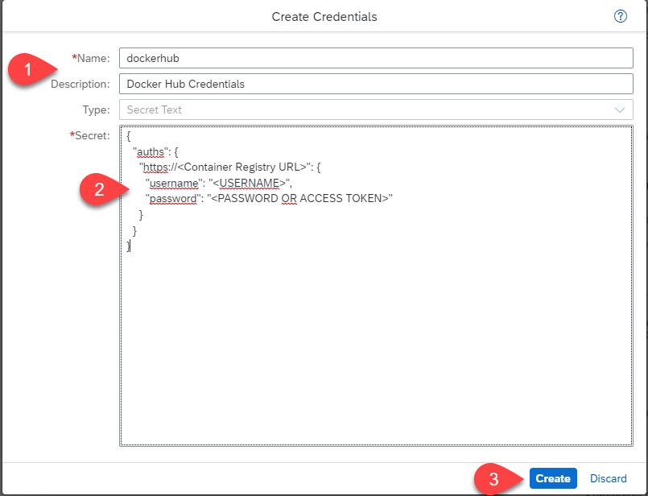
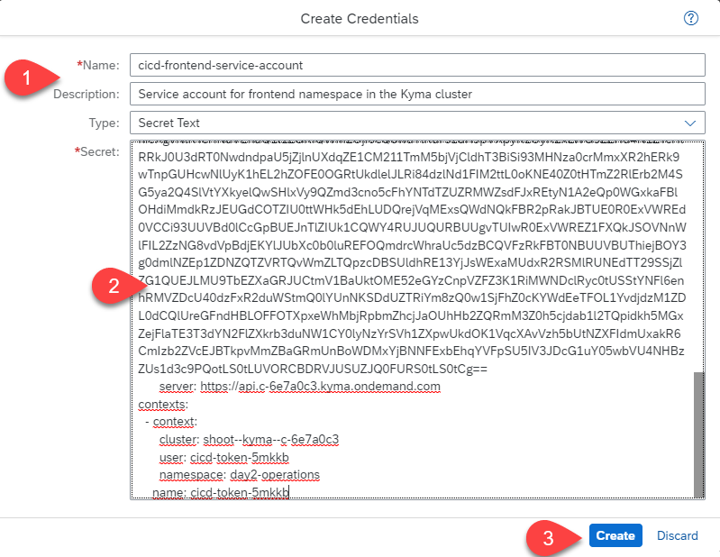
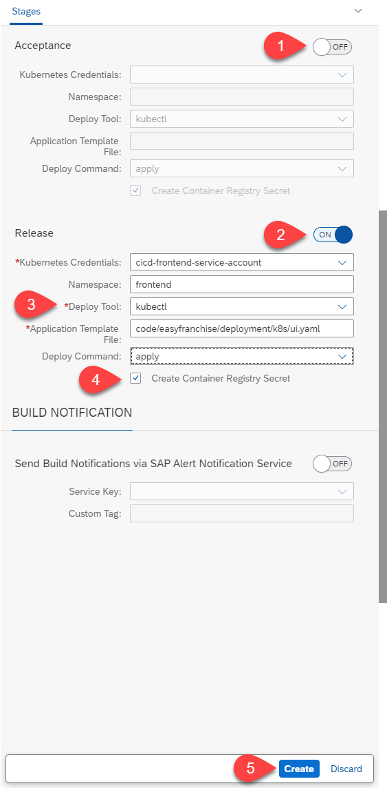

# Create a Job for Easy Franchise UI

In this chapter we will create a job that builds and deploys the Easy Franchise UI into your Kyma cluster.

## Launch the "Continues Integration & Delivery"

   1. In the Subaccount navigate to **Instances and Subscriptions** 
   2. Click on **Go to Application** in the menu of the **Continuous Integration & Delivery** application.

      

## Configure needed Credentials in "Continues Integration & Delivery"

We need credentials for github repo access: 

1. Open the **Credentials** tab and press the **+** button to create a new credential
   
    

2. The Dialog **Create Credentials** will be opened where you enter the following values:  
   
   * Name: The name of the credential, e.g. **github.com**
   * Description: **Personal Access Token for the easyfranchise day2 Github Repo**
   * Enter your github username and the personal access token that you have created above
   * Click on **Create**
      
     

We also need credentials for docker hub:
1. press the **+** to create a another credential and enter a name and description for the credentials, e.g. dockerhub
2. Enter the credential information like that:

   ``` json
   {
      "auths": {
         "https://<Container Registry URL>": {
            "username": "<USERNAME>",
            "password": "<PASSWORD OR ACCESS TOKEN>"
         }
      }
   }
   ```

3. Press **Create** to finalize the credential creation. 

   

Configure the **Service account** credentials for the frontend namespace: 

1. press the **+** to create a another credential and enter a name and description for the and enter a name and description
2. Paste the content of the kubeconfig.yaml which you have downloaded for the service account of the **frontend** namespace (see above)
3. Click on **Create**

   

## Create CI/CD Job for Easy Franchise UI and Configure "General Information"

1. In the **SAP Continuous Integration and Delivery** Application press the **+** button to create a new job.
2. Enter a Job Name and description, e.g. **EasyFranchise-UI**
3. In the repository drop down select **Add Repository** to add your github source repository

   
4. In the upcoming **Add Repository** Dialog:  

   * Enter a name and the Url of your git repository. 
   * In the credentials dropdown, select your github credentials  
   * Click on **remove** to disable the webhook (we'll do that later)
   * click **Add** to finalize the repository configuration.

     

## Configure "Staging" in the CI/CD JOB

In the **Staging** part of the CI/CD JOB we have to configure various things.

Configure the **General Parameters**:

1. Enter the url to the container registry, (e.g. <https://docker.io> for Docker Hub)
2. Enter the image name. For Docker Hub it follows this format: **"username"/"repository name"/"image-name"**. As a free docker hub user you only have one private repository that you can use, therefore we are using username and repository name as image name and make the component name part of the tag. That way we can push multiple images to the same repository.
3. Usually the tag should be your version number of the image and ideally you choose the **Tag Container Image Automatically** to make sure you receive a new version every build. But as written above we will use the repository for more than one image and therefore select a dedicated image tag so we can better see what is happening in our registry.
4. **Container Registry Credentials**: select your already created docker hub credential

    

Configure the **Build**:

1. Check that **Build** is switched on.
2. Enter the path to the dockerfile for the Easy Franchise UI: ```/code/easyfranchise/deployment/docker/Dockerfile-ui```

    

Config **Acceptance** and **Relase**:

1. Disable the **Acceptance** step
2. Enable the **Release** step
3. Fill our the rest of the information:
   * Namespace: frontend
   * Deploy Tool: kubectl
   * Application Template File: ```code/easyfranchise/deployment/k8s/ui.yaml```
   * Deploy Command: apply

4. Mark **Create Container Registry Secret** this will automatically create a secret in the cluster so that the image can be pulled from your repository
5. Click on **Create** to finish the job definition

   

## Run the EasyFranchise-UI JOB

To run the EasyFranchise-UI JOB you just created follow these steps:

1. Select the job
2. Press the **Trigger build** arrows to trigger your fist build
3. You should see a new build job being initialized
4. After the job has been finished it should look like in the screenshot

    