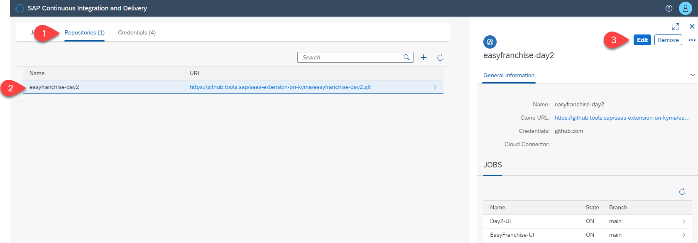
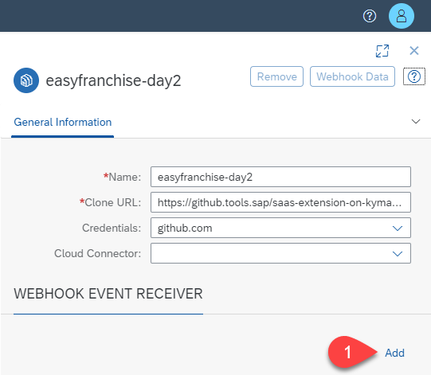
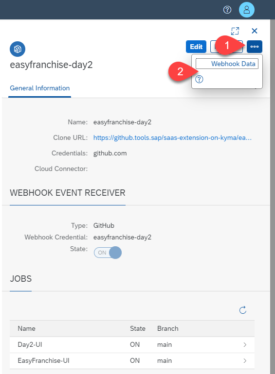
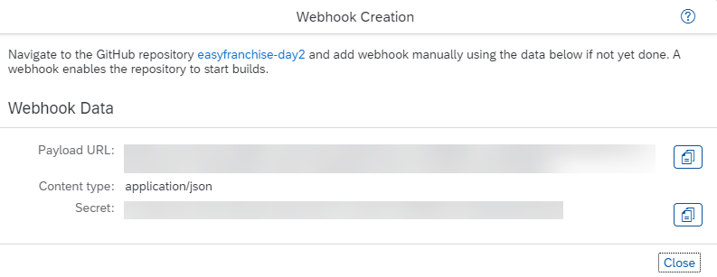
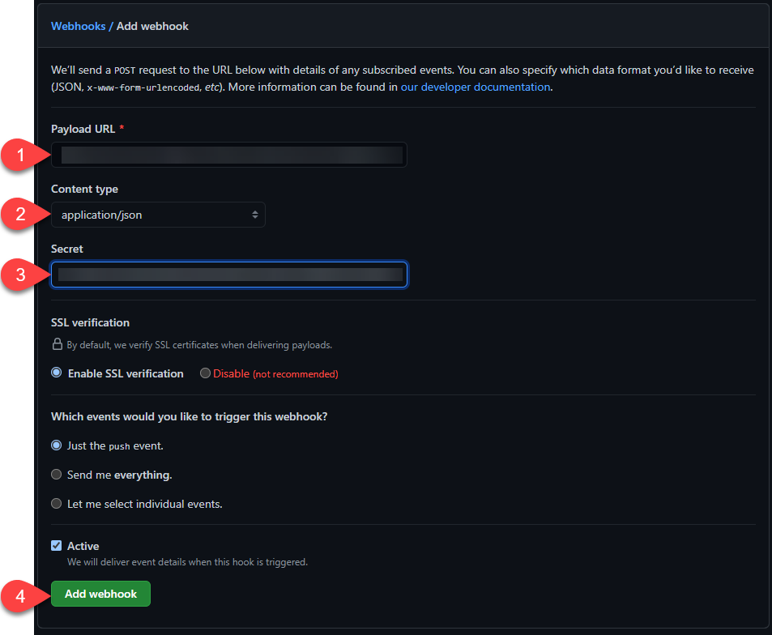

# Create a Webhook for the Git Repository

Now that we have created the jobs for both of our UI's we can trigger the build manually. But what we actually want is that the build is triggered each time when there is a change in the repository automatically. Therefore we will configure a webhook that reacts on changes.

## Enable the Webhook in our repository

1. In the overview screen click on **Repositories**
2. Select your repository
3. Click on **Edit**

   

1. In the repository edit screen click on **Add**

   

1. Use Type GitHub and generate a new webhook credential
2. Click on **Save**

   

## Get the webhook data

1. Click on the **...** in the repository details
2. Click on **Webhook Data**

   

* Either note down the payload URL and the secret or leave the window open, as we need those values for the webhook configuration

  

## Configure the webhook in github

1. Open your repository in github and click on **Settings**
2. Select **Hooks**
3. Click on **Add webhook**

   

4. In the Webhooks Dialog
   * Payload url: use the Payload URL (see  chapter above)
   * Contend Type: application/json 
   * Secret: enter the secret (see chapter above)
   * Click on **Add webhook**

   
  

## Do a test Commit to Trigger the Build

In order to test the webhook you can perform a change (TODO Matt, irgendeine kleine Änderung im UI...)

Once you have pushed the change to the repository both of the jobs are triggered automatically. After the job is finished open the ui and check if your changes are active.

Note: As we have only changed one of the ui's it would be unnecessary to trigger both of the jobs. But as we use one and the same repository for each build job we cannot prevent that.
