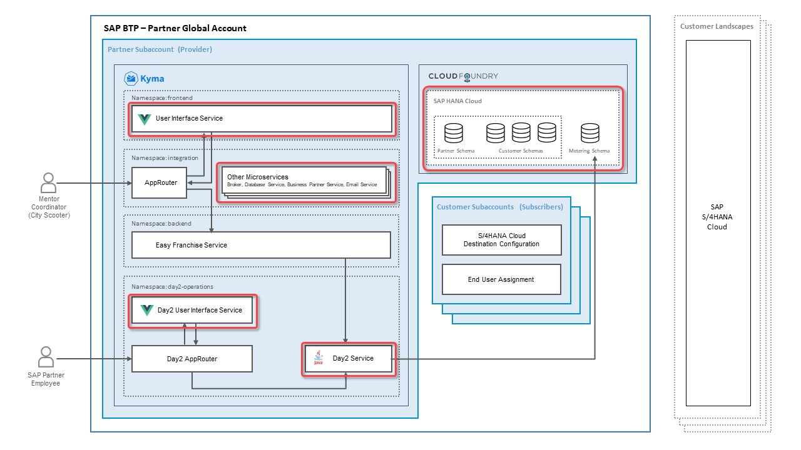
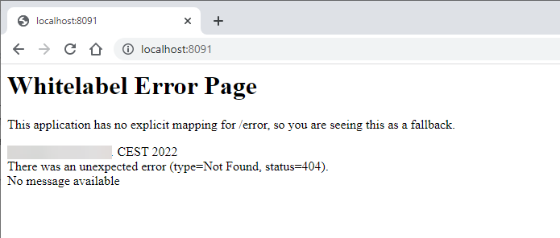

# Run the Metering Scenario End-to-End Locally
 
This chapter explains the steps to run all services involved in the metering scenario locally. This can be done on Windows, Mac or Linux.

You can use these services locally: 
* Database service
* Easy Franchise service
* Business Partner service
* Day2 service
* Easy Franchise UI
* Day2 UI



## Prepare Application Properties for Local Test Run of Day2 Service

Using Spring Boot you can configure properties using application.properties files. There is one under [day2-service/src/main/resources/application.properties](../../../code/day2-operations/source/day2-service/src/main/resources/application.properties). For local testing you can overwrite the properties providing a application.properties file in the spring-boot run command.


1. Copy [code/day2-operations/source/day2-service/application-template.properties](../../../code/day2-operations/source/day2-service/application-template.properties)  as **application.properties**

2. Update the values for those properties:
   * datasource.sqlendpoint: SAP HANA sql endpoint
   * spring.datasource.username: DBADMIN
   * spring.datasource.password: ```<YOURPASSWORD for DBADMIN>```

> Note: If you have used the btp-setup-automator you can find the password for the database either in the [usecasefile](https://github.com/SAP-samples/btp-setup-automator/blob/main/usecases/released/discoverycenter/3999-kyma-day2-operations/usecase.json). Search for the systempassword in the **hana-cloud** entry. Alternatively you can have a look at the db-config secret which is located in the integration namespace of your kyma cluster.

## Build and Test Run the Day2 Service Locally

1. Open a command prompt and change directory to [code/day2-operations/source/day2-service/](../../../code/day2-operations/source/day2-service/).
2. To run the application you have the choice between using spring-boot-plugin or an executive JAR file.
3. Use the following command if you go for the spring-boot plugin:
   ```
   $ ./mvnw spring-boot:run -Dspring.config.location="application.properties"
   ```

   In case of debugging use: 
   ```
   $ ./mvnw spring-boot:run -Dspring-boot.run.jvmArguments="-agentlib:jdwp=transport=dt_socket,server=y,suspend=n,address=8888" -Dspring.config.location="application.properties"
   ```
   
4. Use the following command if you go for the executive JAR file:
   ```
   $ ./mvnw clean package
   $ java -jar target/operations-service-0.0.1-SNAPSHOT.jar -Dspring.config.location="application.properties"
   ```
   
5. Check in the browser that the server is up and running by opening [http://localhost:8091/](http://localhost:8091/). You should get something like this:
    
   

> Hint: in case you would like to use an **application.properties** file in another file location you can also specify the full path as follow:
  > ```
  > -Dspring.config.location="file:///Users/home/config/application.properties"
  > ```
  
## Call the APIs of the Locally Running Day2 Service

1. Let us see if everything is working fine by simulating the user login with the following CURL statement. As a result, this should insert a new record in the database table **USERLOGININFO**. 

   ```shell
   curl --request PUT 'http://localhost:8091/user/login' \
   --header 'Content-Type: application/json' \
   --data-raw '{"tenantid":"tenant1","user":"Jon Smith"}'
   ```
2. Let us now verify that the login has been saved by calling the API to get the metrics about active users. Use the following CURL statement and don't forget to replace the date (```<CURRENT-YEAR>```and ```<CURRENT-MONTH-NUMBER>```) before running it.
   ```shell
   curl --request GET 'http://localhost:8091/user/metric?year=<CURRENT-YEAR>&month=<CURRENT-MONTH-NUMBER>' 
   ```

   You should then get a JSON response as follow:

   ```json
   [{ "tenantid": ""tenant1", "activeUsers": 1 }]
   ```
3. If you like, add other users and/or other tenants and verify the results.


## Start the Database Service, the Easy Franchise Service, and the Business Partner Service

### Prerequisites
- You have prepared the SAP HANA Cloud properties for a JDBC connection. 
- You have a SAP S/4HANA Cloud system or a Business Partner mock server up and running 

### Configure the hiddenconfig.properties File

To run locally the services listed above, you have to configure some properties in the `hiddenconfig.properties` file:
1. Open the prepared sources from the previous steps or download the one from the GitHub [Repository](../../../code/easyfranchise/source/backend). In the **endresult** branch, you will find the source in the [code/easyfranchise/source/backend](../../../code/easyfranchise/source/backend) folder.

2. Copy the file ```code/backend/shared-code/src/main/resources/hiddenconfig-template.properties``` to `hiddenconfig.properties` in the same folder.

3. Maintain your SAP HANA Cloud JDBC connection properties in the `db.*` section. This should look like this:
   ```
   db.name: EasyFranchiseHANADB
   db.sqlendpoint: your_hostname.hanacloud.ondemand.com:443
   db.admin: DBADMIN
   db.password: your_dbadmin_password
   ```

   For more details, see [How to find JDBC Connection Properties](https://github.com/SAP-samples/btp-kyma-multitenant-extension/tree/main/documentation/prepare/configure-hana#how-to-find-jdbc-connection-properties).

4. Update the `s4hana.destination.*` properties.

   If you use the SAP Business Partner mock server to run the application locally, use:

   ```
   s4hana.destination.URL: http://localhost:8081
   s4hana.destination.User:
   s4hana.destination.Password:
   s4hana.destination.Authentication: NoAuthentication
   s4hana.destination.Type: http
   ```

   If you use your SAP S/4HANA Cloud system, copy the following snippet. Be sure to update with your own values:
   ```
   s4hana.destination.URL: https://xxxxxxxx-api.s4hana.ondemand.com
   s4hana.destination.User: <your Communicatrion Arragement User>
   s4hana.destination.Password: <Password of the Communication User>
   s4hana.destination.Authentication: BasicAuthentication
   s4hana.destination.Type: http
   ```

### Build the Project
1. Open a command prompt and change the directory to ```code/easyfranchise/source/backend``` containing the main '''pom.xml'''. Run the following Maven command:
   ```mvn clean install```

   > Info: When running this command the first time, many JAR files will be downloaded to your local Maven repository.

   The second run will be faster as all these downloads will no longer be necessary.

   You should see a successful build of all four modules and an allover **BUILD SUCCESS**:

   ```
      [INFO] Reactor Summary for easyfranchise 1.0-SNAPSHOT:
      [INFO]
      [INFO] easyfranchise ...................................... SUCCESS [  0.784 s]
      [INFO] shared-code ........................................ SUCCESS [ 18.696 s]
      [INFO] db-service ......................................... SUCCESS [  9.189 s]
      [INFO] bp-service ......................................... SUCCESS [  4.606 s]
      [INFO] ef-service ......................................... SUCCESS [  6.742 s]
      [INFO] ------------------------------------------------------------------------
      [INFO] BUILD SUCCESS
      [INFO] ------------------------------------------------------------------------
   ```

   In each project folder, a new folder **target** is created containing the build result.

### Start All Backend Services

Run the following commands to start the services. Start each in a separate command prompt and in the correct folder.

   In folder [code/easyfranchise/source/backend/ef-service](../../../code/easyfranchise/source/backend/ef-service):

   ||command (``> cd ef-service``)|
   |:-----|:----|
   |windows|```java -cp ".\target\*;.\target\dependency\*" -Dlocal_dev=true dev.kyma.samples.easyfranchise.EFServer 8080```|
   |unix   |```java -cp "./target/*:./target/dependency/*" -Dlocal_dev=true dev.kyma.samples.easyfranchise.EFServer 8080```|


   In folder [code/easyfranchise/source/backend/bp-service](../../../code/easyfranchise/source/backend/bp-service):

   ||command (``> cd bp-service``)|
   |:-----|:----|
   |windows|```java -cp ".\target\*;.\target\dependency\*" -Dlocal_dev=true dev.kyma.samples.easyfranchise.ServerApp 8100```|
   |unix   |```java -cp "./target/*:./target/dependency/*" -Dlocal_dev=true dev.kyma.samples.easyfranchise.ServerApp 8100```|

   In folder [code/easyfranchise/source/backend/db-service](../../../code/easyfranchise/source/backend/db-service):

   ||command (``> cd db-service``)|
   |:-----|:----|
   | windows | ```java -cp ".\target\*;.\target\dependency\*" -Dlocal_dev=true dev.kyma.samples.easyfranchise.ServerApp 8090```|
   | unix    | ```java -cp "./target/*:./target/dependency/*" -Dlocal_dev=true dev.kyma.samples.easyfranchise.ServerApp 8090```|


   Each service will run on a different port (8080, 8100, 8090). Don't use different ones. The `hiddenconfig.properties` relies on them!

   >*Hint:* Just in case you want to debug one of the applications using port `8888`, you can start the Java process using the following command. Then, connect with your IDE to the external Java process on port `8888`.

   >```
   >java -Xdebug -Xrunjdwp:transport=dt_socket,address=8888,server=y,suspend=y -cp "./target/*;./target/dependency/*" -Dlocal_dev=true dev.kyma.samples.easyfranchise.ServerApp <port>
   >```

### Test the APIs

1. Check that you can get all mentors:
   ``` 
   curl  --request GET 'http://localhost:8080/easyfranchise/rest/efservice/v1/mentor' 
   ```

   > Note: If the request fails, check the logs of ```ef-service``` and ```db-service```.

2. Check that you can read franchisees.
   ```
   curl --request GET 'http://localhost:8080/easyfranchise/rest/efservice/v1/franchisee' 
   ```
   > Note: If the request fails, check the logs of ```ef-service``` and ```db-service```.


## Run the Easy Franchise UI

1. Check that you have defined the URL path of the backend API to the local backend service. Open the file [code/easyfranchise/source/ui/src/main.js](../../../code/easyfranchise/source/ui/src/main.js) and check the value for ```Vue.prototype.$backendApi```.
   ```js
   Vue.prototype.$backendApi = "http://localhost:8080/easyfranchise/rest/efservice/v1";
   ```
2. Open a new terminal and change directory to **ui**.

   ```shell
   $ cd ui
   ```

3. Install Node.js modules in your repository by running:

   ```shell
   $ npm install
   ```

4. Run the server:

   ```shell
   $ npm run serve
   ```
   As result the application should show where it's running. 
   By default this is at: 

   ```
   http://localhost:8081/
   ```
5. Open this URL in a browser.
6. Opening the Easy Franchise UI will create a login metering info, which you should be able to see in the Day2 UI in the next step. 

   
## Run the Day2 UI
 
1. Similary to what we did for the Easy Franchise UI, we need to update the URL path of the backend API to the local Day2 service. Open the file [code/day2-operations/source/day2-ui/src/main.js](../../../code/day2-operations/source/day2-ui/src/main.js) and check the value for ```Vue.prototype.$backendApi```. Be sure to use the right port started by your terminal for the Day2 service as it may be different from the documentation below.
   
   ```js
   Vue.prototype.$backendApi = "http://localhost:8091/user";
   ```

2. Now you can open a command prompt and go to [code/day2-operations/source/day2-ui](../../../code/day2-operations/source/day2-ui/).

3. Install the Node.js modules.
   ```shell
   $ npm install
   ```
   
4. Start the service.
   ```shell
   $ npm run serve
   ```
   
   As result the application should show where it's running. 
   By default this is at: 

   ```
   http://localhost:8081
   ```
5. Open this URL in a browser.

6. As you already logged in to the Easy Franchise service, which is using the tenant ID 123456789-local-tenant-id, you should find an according record. 

   

7. If you would like to see a second tenant or increase the number of active users, you can achieve this by : 
   - Updating the properties ```devmode.tenantid``` in the ```hiddenconfig.properties``` of the backend services.  Stop, build and start the application again, so that the new tenant ID gets activated and reopen the Easy Franchise UI.
   - (Optional) Running a REST call against the Day2 service via CURL command and fake a user login of, for example, "Jon Smith" for "second-local-tenant-id": 
   
     ```shell
     curl --request PUT 'http://localhost:3000/user/login' \
     --header 'Content-Type: application/json' \
     --data-raw '{"tenantid": "second-local-tenant-id", "user": "Jon Smith"}
     ```
     
> Note: check our [troubleshooting page](./../../troubleshooting/no-active-user-metering-values/README.md) if you can't see any active user metering values.

## Result

* You understand now how to run a local test of all microservices and know the limitations of running the application locally. 
