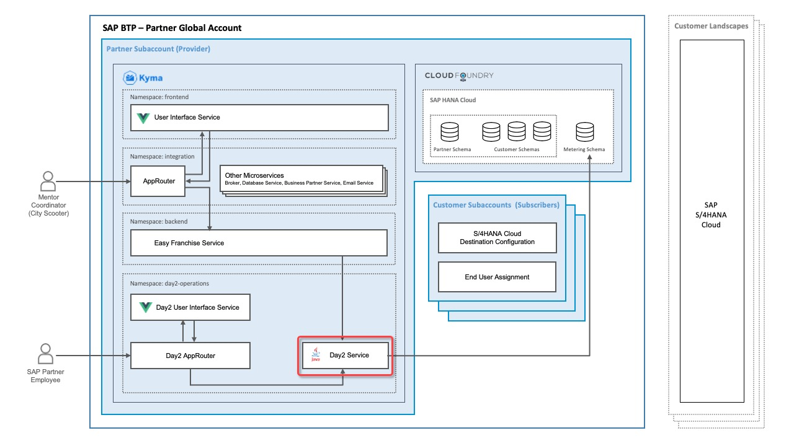

## Understand and Run the Day2 Application locally

## Implementation of the Day2 Service



We have used JAVA as implementation language with [Spring Boot](https://spring.io/projects/spring-boot) and [Hibernate ORM](https://hibernate.org/orm/) as persistence framework. To start the project from scratch, we have used the [spring initializer](https://start.spring.io/) to speed up sources generation. 

The JAVA sources can be found at [code/metering-dashboard/source/operations-service](./../../code/metering-dashboard/source/operations-service).

The [UserRestControler](../../../code/metering-dashboard/source/operations-service/src/main/java/dev/kyma/samples/easyfranchise/rest/service/UserRestControler.java) implements the Rest Endpoints **/user/metric** and **/user/login**.

The [UserLoginInfo](../../../code/day2-operations/source/day2-service/src/main/java/dev/kyma/samples/easyfranchise/day2/jpa/entities/UserLoginInfo.java) defines the persistence Entity. We let Hibernate creates the tables for us. The database user will be defined via the application.properties file described below. 

The [UserLoginInfoService](../../../code/metering-dashboard/source/operations-service/src/main/java/dev/kyma/samples/easyfranchise/services/UserLoginInfoService.java) implements the database access using an autowired [UserLoginInfoRepository](../../../code/metering-dashboard/source/operations-service/src/main/java/dev/kyma/samples/easyfranchise/jpa/repositories/UserLoginInfoRepository.java). 

The following SQL statment provides the number of active users per tenant: 
   ```
   @Query("SELECT new dev.kyma.samples.easyfranchise.day2.rest.entities.UserMetric(tenantid, COUNT(user)) " + //
      "FROM  UserLoginInfo WHERE MONTH=?1 AND YEAR=?2 " + //
      "GROUP BY tenantid")
   public List<UserMetric> getUserMetric(int month, int year);
   ```

To specify properties eg. for the database, overwrite the **application.properties** from the java resource file [src/main/resources/application.properties](../../../code/metering-dashboard/source/operations-service/src/main/resources/application.properties) by one provided at runtime. A [application-template.properties](../../../code/metering-dashboard/source/operations-service/application-template.properties) shows you which values are needed or recommended for local runs. 

You can find more about configuring properties here: [docs.spring.io: Properties & configuration](https://docs.spring.io/spring-boot/docs/1.0.1.RELEASE/reference/html/howto-properties-and-configuration.html)

### Create Metering Database Admin User

<!-- TODO: Alex will this still be valid with your approach? -->

To persist the data in the the database, it's recommended to have a new database user and not re-use an existing one so that you have a clear separation of data. You don't need to create a new database, creating a new user is sufficient. 

1. Get the inital Database Admin User credentials.
2. Open the **SAP HANA Database Explorer** and run the following SQL statement to create a new user called **EFMETERINGADMIN** within the group **EFOPERATORS**. Don't forget to replace the ```<YOURPASSWORD>```.

   ```sql
   -- Create the user and assign to the group EFOPERATORS
   CREATE USER EFMETERINGADMIN PASSWORD <YOURPASSWORD> SET USERGROUP EFOPERATORS;

   -- Make sure that the password should not expire
   ALTER USER EFMETERINGADMIN DISABLE PASSWORD LIFETIME;

   ```

### Add Database Details in the Application Properties

Once the database user created, we can configure the database source properties. 

1. Copy of [code/metering-dashboard/source/operations-service/application-template.properties](../../../code/metering-dashboard/source/operations-service/application-template.properties)  as **application.properties**
2. Update the values for those properties:
   * datasource.sqlendpoint: SAP HANA sql endpoint
   * spring.datasource.username: EFMETERINGADMIN 
   * spring.datasource.password: ```<YOURPASSWORD for EFMETERINGADMIN>```

### Build and Run the Day2 Application

To run the application you have the choice between using spring-boot-plugin or an executive jar. 

1. Use the following command if you go for the spring-boot plugin:
   ```
   $ ./mvnw spring-boot:run -Dspring.config.location="application.properties"
   ```

   In case of remote debugging use: 
   ```
   $ ./mvnw spring-boot:run -Dspring-boot.run.jvmArguments="-agentlib:jdwp=transport=dt_socket,server=y,suspend=n,address=8888" -Dspring.config.location="application.properties"
   ```
1. Use the following command if you go for the executive jar: 
   ```
   $ ./mvnw clean package
   $ java -jar target/operations-service-0.0.1-SNAPSHOT.jar -Dspring.config.location="application.properties"
   ``` 
1. Check in the browser that the server is up and running by opening [http://localhost:8091/](http://localhost:8091/). You should get something like the following screenshot.
    
   

> Hint: in case you would like to use an **application.properties** file in another file location you can also specify the full path as follow:
  > ```
  > -Dspring.config.location="file:///Users/home/config/application.properties"
  > ```
  
### Test the APIs of the Day2 Application

1. Let us see if everything is working fine by to login a user with the following curl statement. As a result, this should insert a new record in the database table **USERLOGININFO**. 

   ```shell
   curl --request PUT 'http://localhost:8091/user/login' \
   --header 'Content-Type: application/json' \
   --data-raw '{
       "tenantid": "tenant1",
       "user": "Jon Smith"    
   }
   ```
   
1. Let us now verify that it has been saved by calling the API to get the metrics about active users. Use the following CURL statement and don't forget to replace the date (```<CURRENT-YEAR>```and ```<CURRENT-MONTH-NUMBER>```) before running it.
   ```shell
   curl --request GET 'http://localhost:8091/user/metric?year=<CURRENT-YEAR>&month=<CURRENT-MONTH-NUMBER>' 
   ```

   You should then get a JSON response as follow:

   ```json
   [{ "TENANTID": "123456789-local-tenant-id", "ACTIVEUSERS": 1 }]
   ```

1. Add other users and/or other tenants and verify the results.


## Understand and Run the Day2 UI

The user interface is developed with [SAP Fundamental Vue Library](https://sap.github.io/fundamental-styles/?path=/docs/introduction-overview--page). [SAP Fundamental Styles](https://sap.github.io/fundamental-styles/?path=/docs/introduction-overview--page) is a lightweight presentation layer, that can be used with various UI frameworks. With Fundamental Library Styles, consistent SAP Fiori apps in any web-based technology can be built. In this tutorial Vue is used as a framework to develop graphical user interfaces.

<!-- TODO: Matthieu to add dmore details on structure -->

## Understand the Implementation of the Day2 AppRouter
<!-- 
TODO:  Alex/Britta

TODO: Matt - Is this section really needed???

TODO: should we explain the Auth+autorisation here as well? or should we refear to the Main missions approuter explenation?

-->

## Result
* You understand the implementation of the Day1 application components.
* You have tested and validated the new APIs locally.
* You have learned how the Day2 Ui and the Day2 AppRouter works.