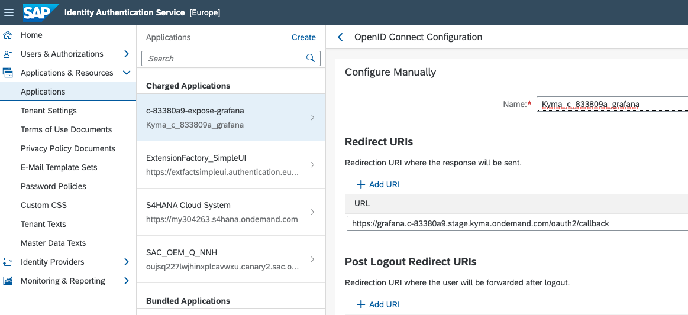
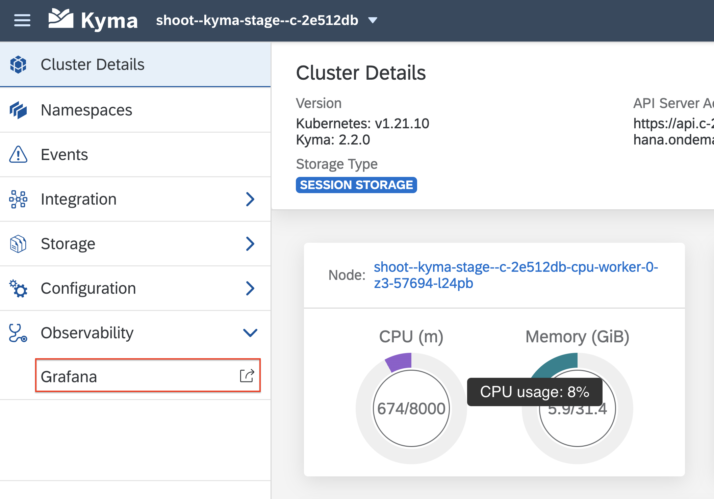
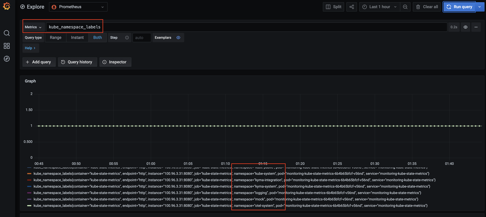
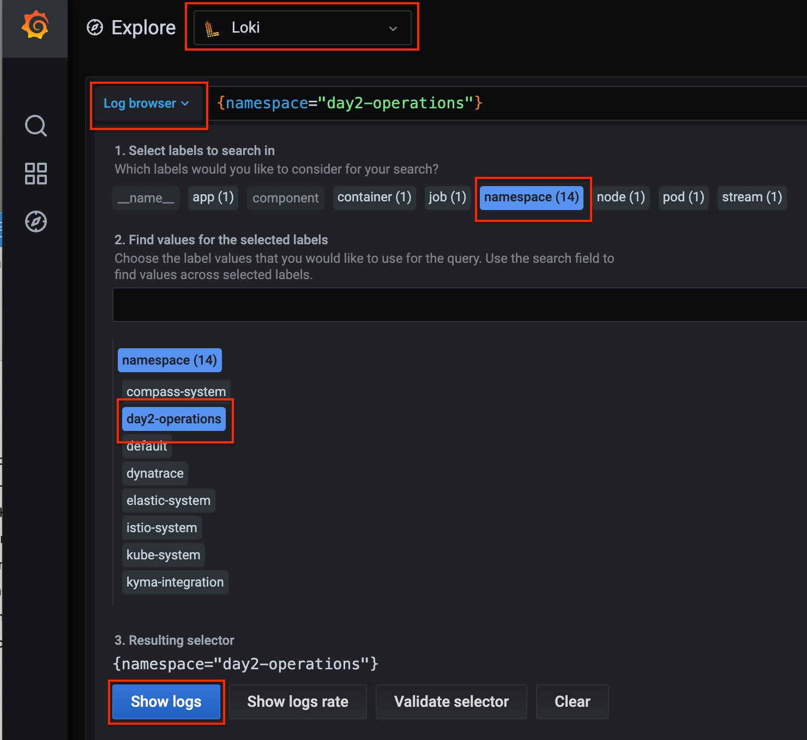

# Exposing built-in Grafana securely with Identity Authentication (IAS)

Kyma comes with Grafana, which provides a dashboard and a graph editor to visualize metrics and logs. By default, Kyma doesn't expose Grafana. We recommend that you expose Grafana securely so you can access it directly from Kyma Dashboard. 

## Configure Identity Authentication Service

For exposinig the Grafana dashboard outside the cluster, we need to have an authentication provider, which is achieved through SAP Identity Authentication service.

To obtain a tenant of Identity Authentication please refer to [official document](https://help.sap.com/docs/IDENTITY_AUTHENTICATION/6d6d63354d1242d185ab4830fc04feb1/93160ebd2dcb40e98aadcbb9a970f2b9.html#getting-a-tenant).

1. In Identity Authentication, create a new OpenID Connect application for Identity Authentication. Select the application just being created, and click on Protocol. Set protocol to **OpenID Connect** and click **Save** button.

   

1. Click on **OpenID Connect Configuration**,  then choose a proper name and set the callback URL to the path `https://grafana.<your-Kyma-cluster-domain>/oauth2/callback`. Then click **Save** button. 

   

   Note that the domain of Kyma cluster follows the convention  `https://grafana.<cluster-domain>`,  e.g. https://grafana.c-83380a9.stage.kyma.ondemand.com/

1. Click on **Client Authentication**. Then click **Add** button to create a secret in IAS for API Authentication. 

    

1. In the opened dialog provide meaningful description check what is preselected in for **Expiere in**. All **scopes** should be selected. Click on **Save** button. Note down the **Client ID** and **Client Secret** in the popup window.
   
   
1. Create a Secret for OAuth2 Proxy in Kyma cluster

   The **client_id_from_IAS** and **client_secret_from_IAS** are created in previous step. The **IAS URL** is the URL of your Identity Authentication tenant URL.
   Before running the below command, replace below placeholders with your own values.

   ```shell
   kubectl -n kyma-system create secret generic monitoring-auth-proxy-grafana-user \
   							--from-literal="OAUTH2_PROXY_CLIENT_ID=<client_id_from_IAS>" \
   							--from-literal="OAUTH2_PROXY_CLIENT_SECRET=<client_secret_from_IAS>" \
   							--from-literal="OAUTH2_PROXY_OIDC_ISSUER_URL=<IAS URL>" \
   							--from-literal="OAUTH2_PROXY_PROVIDER=oidc" \
   							--from-literal="OAUTH2_PROXY_SCOPE=openid email" \
   							--from-literal="OAUTH2_PROXY_SKIP_PROVIDER_BUTTON=true"
   ```

1. Restart the OAuth2 Proxy pod by run the following command

   ```shell
   kubectl -n kyma-system rollout restart deployment monitoring-auth-proxy-grafana
   ```
## Learn Which Data can be found in Grafana 

1. Now click on the Grafana link in Kyma Dashboard as shown below

   


1. You can then go to **Explorer** on the sidebar to check which metrics are available.

   

   In addition, you can also choose **Loki** from dropdown menu to view the logs. Below screen shows an example of filtering pod logs from namespace **day2-operations**.

      

      

## Reference

* [SAP Help: Set up Grafana Authentication](
https://help.sap.com/docs/BTP/65de2977205c403bbc107264b8eccf4b/3e4299cfd0884c428e6b4774225638e8.html)
