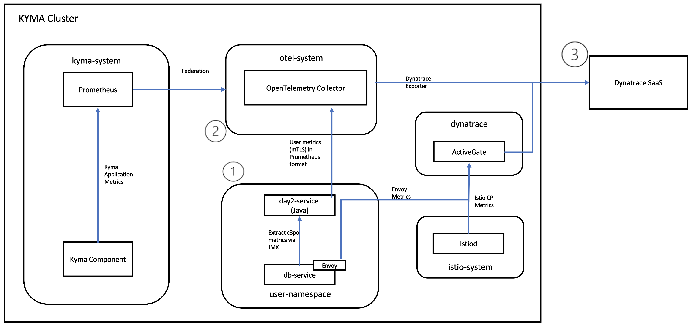
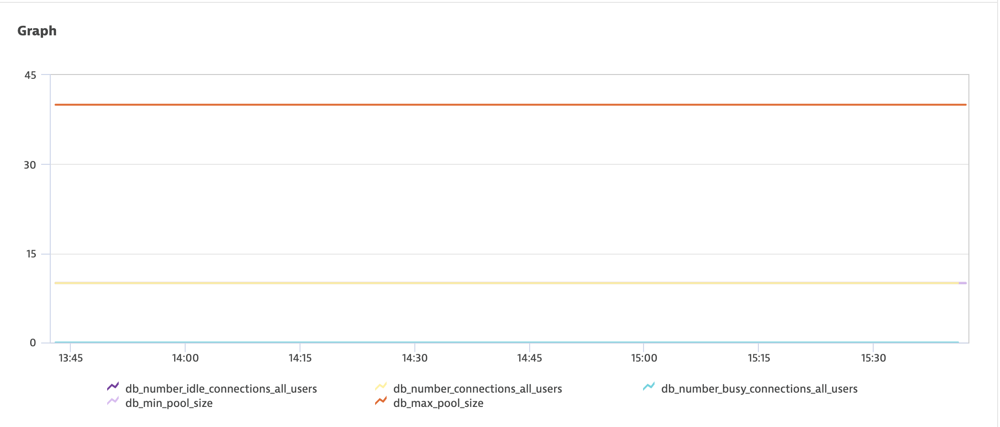

# Monitoring Custom Metrics in Dynatrace

In chapter [monitor Kyma in Dynatrace](../monitor-kyma-in-dynatrace/README.md) it is demostrated how Kyma cluster can be monitored in Dynatrace.  In this section we will show how to ingest custom metrics of your own application into Dynatrace. 

To demostrate how to expose custom metrics of your application through HTTP endpoint, we are using metrics database connection pool used by **DB service** of the **Easyfranchise application**.

The **DB service** uses **Hibernate** as object-relational mapping framework to persist domain model entities to a relational database. The [SynchronizedConnectionMap java class](https://github.com/SAP-samples/btp-kyma-multitenant-extension/blob/main/code/easyfranchise/source/backend/db-service/src/main/java/dev/kyma/samples/easyfranchise/dbservice/SynchronizedConnectionMap.java) make use of the  **C3P0ConnectionProvider class**, provided by Hibernate. This connection provider uses a [C3P0 connection pool](https://www.mchange.com/projects/c3p0/).

To illustrate how custom metrics are exposed in [Prometheus format](https://prometheus.io/docs/concepts/data_model/#metric-names-and-labels)<sup>[1](#OpenMetrics)</sup> through your own application, following example is provided:
[C3P0 DB connection pool metrics](../../../code/day2-operations/source/day2-service/src/main/java/dev/kyma/samples/easyfranchise/day2/rest/jmx/C3P0ConnectionPoolMetricsScheduler.java) implemented using [Prometheus Java client](https://github.com/prometheus/client_java). In our DB-service [c3p0 pool](https://www.mchange.com/projects/c3p0/) is used to access the database of the Easy Franchise application. We collected the following metrics to provide a real-time monitoring of the database connecion usage for each of the subscribed tenants:

  - db_number_connections_all_users
  - db_number_idle_connections_all_users
  - db_number_busy_connections_all_users
  - db_min_pool_size
  - db_max_pool_size


The diagram below shows the flow of the custom metrics:




1. C3P0 database connection pool is created by *db-service*. The pool metrics are collected periodically by *day2-service* via JMX. *day2-service* exposes collected metrics through an HTTP endpoint in Prometheus format as shown below:

```shell
# HELP db_number_idle_connections_all_users Number of idle database connections for all users
# TYPE db_number_idle_connections_all_users gauge
db_number_idle_connections_all_users{Tenant="DAY2ADMIN",} 10.0
db_number_idle_connections_all_users{Tenant="CITY-SCOOTER",} 10.0
# HELP db_number_busy_connections_all_users Number of busy database connections for all users
# TYPE db_number_busy_connections_all_users gauge
db_number_busy_connections_all_users{Tenant="DAY2ADMIN",} 0.0
db_number_busy_connections_all_users{Tenant="CITY-SCOOTER",} 0.0
# HELP db_min_pool_size Min number of database connections
# TYPE db_min_pool_size gauge
db_min_pool_size{Tenant="DAY2ADMIN",} 10.0
db_min_pool_size{Tenant="CITY-SCOOTER",} 10.0
# HELP db_max_pool_size Max number of database connections
# TYPE db_max_pool_size gauge
db_max_pool_size{Tenant="DAY2ADMIN",} 40.0
db_max_pool_size{Tenant="CITY-SCOOTER",} 40.0
# HELP db_number_connections_all_users Number of database connections for all users
# TYPE db_number_connections_all_users gauge
db_number_connections_all_users{Tenant="DAY2ADMIN",} 10.0
db_number_connections_all_users{Tenant="CITY-SCOOTER",} 10.0
```

2.  *OpenTelemetry collector* retrieves the metrics through the HTTP endpoints above with the following configurations.  Use the `tls_config` and `scheme` for services that need strict peer authentication, as shown in the following example. The Collector Configuration uses an Istio sidecar to receive a certificate, but does not intercept any traffic.

  > Note: both parameters **metrics_path** and **target** are combined to compose the HTTP endpoint URL (e.g.: http://day2-service.day2-operations.svc.cluster.local:8091/prometheus/metrics).  

```yaml
      prometheus:
        config:
          scrape_configs:
            - job_name: 'db_jmx_metrics'  ## c3p0 pool metrics
              tls_config:
                ca_file: /etc/istio-output-certs/root-cert.pem
                cert_file: /etc/istio-output-certs/cert-chain.pem
                insecure_skip_verify: true
                key_file: /etc/istio-output-certs/key.pem
              scheme: https 
              scrape_interval: 15s
              metrics_path: '/prometheus/metrics'  
              static_configs:
                - targets:
                  - 'day2-service.day2-operations.svc.cluster.local:8091'               
```
        
Note that although the endpoint is exposed in http, the istio sidecar injection automatically enables **https** access through the service mesh. Hence the **scheme** is set to **https** above. The required certificate for SSL connection is provided through below code snipet. 

```yaml
      annotations:
        proxy.istio.io/config: |
          # configure an env variable `OUTPUT_CERTS` to write certificates to the given folder
          proxyMetadata:
            OUTPUT_CERTS: /etc/istio-output-certs
        sidecar.istio.io/inject: "true"
        sidecar.istio.io/userVolumeMount: '[{"name": "istio-certs", "mountPath": "/etc/istio-output-certs"}]'
        traffic.sidecar.istio.io/includeInboundPorts: ""
        traffic.sidecar.istio.io/includeOutboundIPRanges: ""
```

The complete file *otel-agent-mtls.yaml* with the configuration above can be found at the [otel-agent-mtls.yaml](../../../code/day2-operations/deployment/k8s/otel-agent-mtls.yaml) file.  To enable the scraping of database metrics, please uncomment the configuration for job `db_jmx_metrics` in above file and re-apply it to your cluster:

```shell
kubectl apply -f otel-agent-mtls.yaml
```


3. With the *Dynatrace exporter* from the *OpenTelemetry collector*, the metrics are forwarded to the Dynatrace instance. In Dynatrace, you can create a dashboard based on the custom metrics above. 




### JMX Metrics for C3P0 Connection Pool

The flow for retrieving C3P0 connection pool metrics is discussed in the previous section. In this section, we will briefly discuss some implementation considerations.

- In *day2-service*, we implemented a scheduler to poll the metrics perodically through JMX port 9999 of db-service. 

```java
  public C3P0ConnectionPoolMetricsScheduler(@Value("${jmx.remote.host}") String remoteHost, @Value("${jmx.remote.port}") int remotePort) {

    this.attributeClient = new JmxMBeanClient(remoteHost, remotePort);  // create jmx client with db-service host and port

    C3P0GaugeController.createSingletonInstance();
  }

  @Scheduled(fixedRateString = "5000", initialDelayString = "0")
  public void schedulingTask() {

    logger.info("schedulingTask get called, updating metrics");

    C3P0GaugeController.retrieveMetrics(attributeClient);  // retrieving metrics from jmx port of db-service
  }

```

- To enable the access to *db-service* JMX port, simply adapt the following command line parameters in the [Dockerfile-db-service](../../../code/easyfranchise/deployment/docker/Dockerfile-db-service).

```Diff

# Expose jmx port 9999
+EXPOSE 9999

# start the db-service normally
-CMD ["java", "-cp",  "/opt/app/*", "dev.kyma.samples.easyfranchise.ServerApp", "8080"]

# start the db-service with jmx port enabled
+CMD ["java", "-Dcom.sun.management.jmxremote.port=9999", "-Dcom.sun.management.jmxremote.authenticate=false", "-Dcom.sun.management.jmxremote.ssl=false", "-cp",  "/opt/app/*", "dev.kyma.samples.easyfranchise.ServerApp", "8080"] 
```

Enable the JMX port access within the cluster by adding the following configuration to [db-service.yaml](../../../code/easyfranchise/deployment/k8s/db-service.yaml)

```yaml
---
apiVersion: v1
kind: Service
metadata:
  name: db-jmx-metrics
  namespace: integration
  labels:
    app: db-jmx-metrics
spec:
  type: ClusterIP
  ports:
    - port: 9999
      protocol: TCP
      targetPort: 9999  
  selector:
    app: db-service
```

- We are using [Prometheus Java client](https://github.com/prometheus/client_java) to store and expose the metrics in Prometheus format. There is another popular package [Micrometer](https://micrometer.io/) which could serve a similar purpose. However, we decided not to use it as it [lacks native support of dynamic label for gague](https://github.com/micrometer-metrics/micrometer/issues/535) (In Micrometer the term *Tag* is used, whereas in Prometheus *Label* is used).  In our application, we need to be able to add a label to metrics dynamically based on the subscribed tenant name, such as *CITY-SCOOTER*. Prometheus Java client supports **defining label name** and **adding lable value** at a separate time.

```java
    static String LABEL_NAMES = "Tenant";
    
    // first, define label name without provide lable value
    dbNumIdleConnectionsAllUsers =  Gauge.build()
                                    .name("db_number_idle_connections_all_users")
                                    .help("Number of idle database connections for all users").labelNames(LABEL_NAMES)
                                    .register(); 
                                    

    // later adding lable value only when corresponding metric is avaiable

    Object label = attributeClient.retrieveAttributeValue(bean, LABEL_SOURCE, false, null); // label = subaccount ID
    logger.info("Retrieving C3P0 Pool Metrics for label:" +  label.toString() );

    AttributeList attrList = attributeClient.retriveAttributeList(bean, attrListString);
    for(Attribute a : attrList.asList()){
        String attrName = a.getName();
        if(attrName.equalsIgnoreCase(ATTR_NUM_IDLE_CONNECTIONS_ALL_USERS)){
            dbNumIdleConnectionsAllUsers.labels(label.toString()).set((Integer) a.getValue());    // adding lable value when setting corresponding metric value
        }
    ... 
    }
```

## Reference:

<a name="OpenMetrics">1</a>: [OpenMetrics](https://openmetrics.io/) format is a more vendor neutral succssor of the Prometheus format
